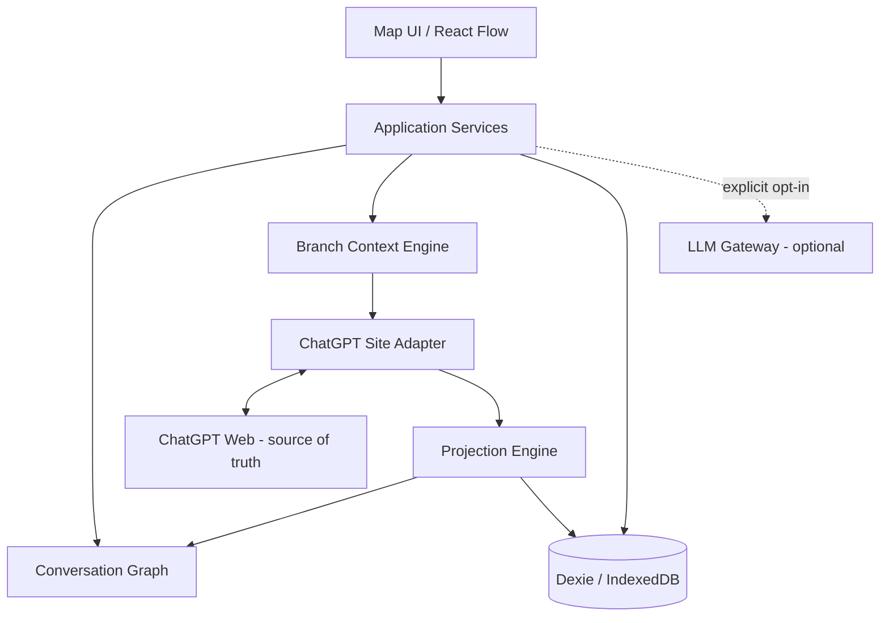

# 架构与边界

## 1. 架构原则

1. **事实源唯一**：ChatGPT 拥有原始消息、会话生命周期、发送与分支行为。
2. **投影可重建**：Turn/Card 内容来自事实源快照；删除投影缓存后可以重新生成。
3. **元数据独立**：布局、折叠、用户标题、标签等是插件拥有的数据。
4. **逻辑与视觉分离**：逻辑边来自来源顺序或真实分支；坐标只负责展示。
5. **平台能力显式化**：Site Adapter 报告能力，不假定所有平台都能 fork、定位或获得稳定 ID。
6. **增量更新**：流式回答只更新活动 Turn，避免重建整个画布。
7. **失败不伤原会话**：插件故障只能影响地图体验，不能阻断 ChatGPT 正常使用。

## 2. 逻辑分层

## 3. 模块职责

### Site Adapter

隔离平台差异。负责检测站点、读取会话快照、监听变化、定位消息、报告能力，并把分支/发送意图交回平台。它不决定卡片布局，也不直接写数据库。

### Projection Engine

把平台消息流规范化，将 Question 与后续 Answer 聚合为 Turn；处理流式状态、重复事件、缺失消息与重新同步。它不依赖 React Flow。

### Conversation Graph

维护 Turn 节点与逻辑边，验证图不变量，提供祖先、路径、子树等查询。图结构是纯领域层，不读 DOM、不操作浏览器 API。

### Branch Context Engine

从选定 Turn 构造“用户想从哪里继续”的上下文与分支请求。它区分来源上下文、用户选择片段、补充说明与目标平台能力，不直接调用模型。

### Storage

保存插件拥有的元数据、可重建的投影缓存、Adapter 诊断信息与 schema 版本。所有迁移必须可测试。

### LLM Gateway

预留统一接口，用于摘要、标题、标签和语义能力。默认关闭，必须由用户选择 Provider 并明确同意发送哪些内容。首版核心功能不得依赖 LLM。

### Extension Entrypoints

后续代码阶段计划包含：

- Background：跨标签页协调、扩展页与 Content Script 通信。
- Content Script：ChatGPT 读取、观察、定位及最小 UI 注入。
- Extension Page：完整地图工作区。
- Popup（可选）：状态与快捷入口，不承载主工作流。

## 4. 数据所有权

| 数据 | 所有者 | 是否可重建 | 删除影响 |
|---|---|---:|---|
| ChatGPT 原始消息 | ChatGPT | 否 | 原对话内容丢失 |
| 标准化消息快照 | 插件缓存 | 是 | 下次打开重新采集 |
| Turn/Card 投影 | 插件缓存 | 是 | 重新投影恢复 |
| 逻辑边 | 来源关系/插件投影 | 通常是 | 重新投影恢复；手工关联除外 |
| 卡片坐标与视口 | 插件 | 否 | 仅布局重置 |
| 用户标题、标签、折叠 | 插件 | 否 | 个性化组织丢失 |
| 分支执行结果 | ChatGPT + 插件引用 | 部分 | 原会话仍由 ChatGPT 持有 |

## 5. 关键运行时数据流

### 初次投影

1. Adapter 检测受支持的 ChatGPT 会话页。
2. Adapter 生成带诊断信息的会话快照。
3. Projection Engine 规范化消息并配对为 Turn。
4. Conversation Graph 生成逻辑边并校验不变量。
5. Storage 合并可重建投影与已有布局元数据。
6. Map UI 渲染。

### 流式更新

1. DOM 变化先去抖并限定到候选消息区域。
2. Adapter 只重读活动消息或受影响范围。
3. Projection Engine 使用稳定来源键执行幂等合并。
4. UI 更新对应卡片；回答完成后固化状态。

### 分支执行

1. 用户从 Turn 选择“创建分支”。
2. Branch Context Engine 生成分支意图。
3. Adapter 根据能力选择真实 fork、原生编辑/重试路径或明确的降级方案。
4. 平台确认新会话/分支后，投影层才创建真实 branch edge。

## 6. 通信约束

- 跨入口消息必须使用有版本、可判别的消息协议。
- 请求必须有 request ID；响应必须表达成功、能力不支持或可诊断错误。
- Content Script 不接受扩展来源之外的任意页面消息。
- 不在消息总线中长期保存完整聊天；只传递当前操作所需数据。

## 7. 与 dsh-synapse 的差异

dsh-synapse 运行在拥有原生会话桥接能力的 DSH Web 环境中；本项目运行在第三方网页上，平台接口和 DOM 均可能变化。因此本项目必须额外设计：能力探测、选择器多策略、解析置信度、失败隔离、重新同步和不伪造分支的降级路径。

