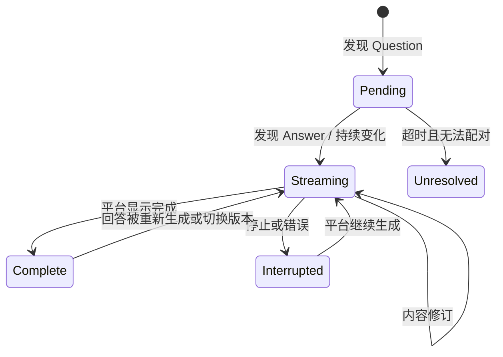

# 领域模型与数据流

本文定义概念与不变量，不规定具体 TypeScript 写法。

## 1. 核心实体

### SourceConversation

代表 ChatGPT 中的一条原始会话引用。

| 字段概念 | 说明 |
|---|---|
| sourceKey | Adapter 命名空间内稳定且不暴露敏感内容的会话键 |
| platform | 首版固定为 `chatgpt` |
| canonicalUrl | 可用于返回原会话的规范地址 |
| title | 平台标题，可为空 |
| observedAt | 最近成功采集时间 |
| adapterVersion | 产生快照的适配器版本 |

### SourceMessage

Adapter 输出的标准化消息。包含来源键、角色、顺序、纯文本/受控富文本、状态、可定位句柄与时间信息。DOM 节点本身不得进入持久化层。

### Turn

认知与图谱的最小节点：一个用户 Question，加上随后属于该轮的一个或多个 Assistant 消息，最终展示为一个 Answer。

| 字段概念 | 说明 |
|---|---|
| turnKey | 由来源会话与来源消息稳定推导 |
| question | 用户问题的投影内容 |
| answer | 助手回答的投影内容，可为空 |
| status | pending、streaming、complete、interrupted、unresolved |
| sourceRefs | Question/Answer 的来源引用 |
| logicalParentKey | 逻辑父 Turn；不得由坐标推导 |
| contentRevision | 内容变化序号，用于幂等更新 |

### GraphEdge

首版边类型：

- `sequence`：同一原始会话中的先后关系。
- `branch`：经平台确认的真实分支关系。
- `reference`：用户手工建立的视觉/语义参考，不表示会话血缘。

UI 必须用不同样式表达三者，避免把 reference 误解为 branch。

### LayoutMetadata

包含卡片坐标、尺寸、折叠状态、视口和可选分支锚点。布局记录引用 `turnKey`，不能反向定义逻辑父子关系。

### BranchIntent / BranchResult

`BranchIntent` 描述起点 Turn、选中文本、补充问题、期望策略与用户动作；`BranchResult` 记录平台确认的目标会话/消息引用、实际采用策略和失败原因。

## 2. 聚合规则

基础配对规则：

1. 用户消息开始一个新 Turn。
2. 该消息后的 Assistant 消息归入当前 Turn，直到下一条用户消息出现。
3. 多段 Assistant 输出保留内部顺序，卡片展示最终可读 Answer。
4. 没有 Question 的孤立 Assistant 消息不强行配对，标为 unresolved 并进入诊断。
5. 流式变化更新现有 Turn，不创建重复 Turn。
6. 重新生成/编辑导致的多版本回答，在 Adapter 能稳定识别时保留版本信息；首版 UI 可只展示活动版本。

## 3. 图不变量

- 一个 Turn 必须且只能属于一个 SourceConversation。
- `sequence` 边在单一会话内构成有向无环路径。
- `branch` 边只有在平台确认目标来源后才能持久化为真实分支。
- 坐标变化不得修改 `logicalParentKey` 或任何逻辑边。
- 相同来源键的重复快照必须幂等合并。
- 删除可重建投影不得级联删除 ChatGPT 内容。
- 用户元数据必须在重新投影后按稳定 `turnKey` 重新挂接。

## 4. 身份策略

身份优先级从高到低：

1. 平台提供的稳定会话 ID / 消息 ID。
2. 稳定 DOM 属性组合。
3. 会话键 + 角色 + 逻辑序号 + 内容指纹的派生键。

派生键是降级方案。若前序消息被编辑导致键漂移，Projection Engine 应执行相似匹配并产生迁移候选；置信度不足时保留旧元数据并请求用户确认，不能静默错绑。

## 5. 内容表示

- 领域层保存安全、可序列化的文本与结构化块，不保存原始 DOM。
- HTML 必须在展示前清理；不执行消息内脚本、事件属性或未知 URL scheme。
- 卡片可保存截断后的展示内容，但来源引用必须允许返回原页面查看全文。
- 附件首版只保存类型、名称与来源存在性，不复制二进制内容。

## 6. 投影状态机

