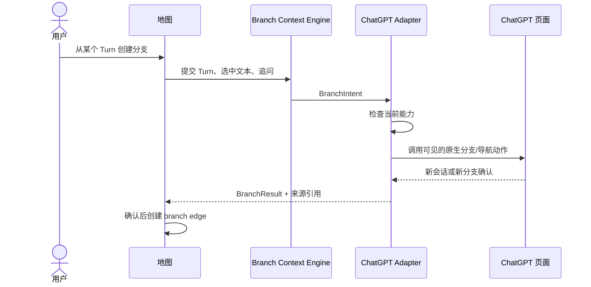

# 分支与双向定位

## 1. 分支的语义

“真实分支”是 ChatGPT 平台能够识别、打开并继续的会话路径，并且插件取得可持久引用。仅在画布上复制卡片或连线不构成真实分支。

## 2. 分支工作流

## 3. 上下文构造

Branch Context Engine 产生结构化上下文，而不是简单拼接整段历史。上下文候选包括：

- 分支起点之前的必要路径。
- 当前 Turn 的 Question 与 Answer。
- 用户选中的回答片段。
- 用户的新问题或补充说明。
- 来源引用与截断说明。

首版优先使用平台原生分支，使平台自己继承真实上下文。只有原生能力不可用且用户选择“创建新会话并带入摘要”时，才使用文本化上下文；该路径必须标记为 `derived-context`，不能画成原生 branch。

## 4. 降级等级

| 等级 | 行为 | 图谱表达 |
|---|---|---|
| A | 平台原生分支成功并获得来源引用 | `branch` 实线 |
| B | 平台允许从旧消息编辑/继续且结果可验证 | `branch` 实线，记录策略 |
| C | 新会话带入用户确认的派生上下文 | `reference` 虚线，标注“上下文派生” |
| D | 仅复制上下文到剪贴板/草稿 | 不提前创建边 |
| E | 能力不可用 | 不修改图，显示原因 |

## 5. 地图到原聊天

点击卡片后：

1. 若原会话标签页存在，激活该标签页。
2. 若不存在，打开规范会话 URL。
3. Adapter 等待页面就绪并定位来源消息。
4. 滚动到消息并短暂高亮。
5. 返回定位结果；失败不能被伪装为成功。

## 6. 原聊天到地图

ChatGPT 页面提供最小入口“在地图中查看”：

1. Adapter 判断当前可见或用户触发的消息。
2. 解析其 `turnKey`。
3. 打开或激活地图扩展页。
4. Map UI 展开祖先路径、居中并选中卡片。

若投影尚未存在，先请求增量同步；同步失败时展示诊断。

## 7. 并发与重复操作

- 同一 BranchIntent 具有幂等键，重复点击不会提前创建多条边。
- 页面导航期间分支按钮进入等待状态，但允许安全取消。
- 如果平台已经创建目标而插件未收到确认，重新扫描时应识别孤立候选并允许用户关联。
- 多标签页打开同一会话时，由后台协调器选择最近活跃且已连接的页面。

