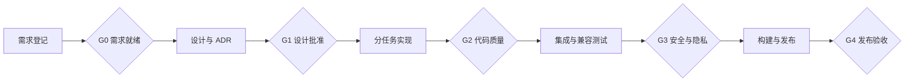

# 项目团队与协作流程

## 1. 团队目标

本项目采用“小型核心团队 + 按阶段启用角色”的协作方式。每项交付物只有一个主责人，中高风险修改必须由非作者独立复核，用户保留产品范围与高风险变更的最终决定权。

团队可以由人类与 AI 协同承担；角色代表责任，不要求每个角色始终由独立人员常驻。角色合并时，开发者不得独自批准自己的中高风险修改。

## 2. 团队组成

| 席位 | 角色代号 | 核心职责 | 关键交付物 |
|---|---|---|---|
| 产品决策人 | PO | 确认目标、范围、优先级、隐私边界和最终验收 | 范围决策、验收决定、高风险批准 |
| 项目负责人 / 架构师 | TL | 协调任务，维护架构边界、接口契约、ADR 和集成质量 | 路线图、任务拆分、架构评审、ADR |
| ChatGPT Adapter 工程师 | ADP | 验证 DOM、导航、消息定位、能力快照和真实分支路径 | 技术探针、Adapter、fixture、兼容报告 |
| 图谱与数据工程师 | GDE | 负责 Projection、Graph、Branch Context、Dexie 和迁移 | 领域实现、schema、迁移、图谱测试 |
| 扩展与交互工程师 | UIE | 负责 WXT 入口、消息通信、React Flow 与双向定位体验 | 扩展入口、地图 UI、交互与集成测试 |
| QA / 安全 / 发布负责人 | QSR | 独立验证功能、兼容性、权限、隐私、构建和发布 | 测试报告、安全清单、发布与回滚结论 |

### 当前负责人约定

- 用户担任 PO，拥有范围、隐私和最终验收决定权。
- Codex 主协调者承担 TL，负责组织专项角色、合并结果和维护修改日志。
- ADP、GDE、UIE、QSR 在相关阶段以专项执行者或审查者身份启用。
- 专项角色只在任务授权范围内工作，不自行扩大产品范围。

### 当前项目名册

| 席位 | 执行标识 | 当前状态 | 下一项职责 |
|---|---|---|---|
| PO | 用户 | 在位 | 决定是否授权启动阶段 0，并批准 T0-04/T0-05 |
| TL | `root` | 在位 | 建立任务卡、协调接口、维护 ADR 与修改日志 |
| ADP | `adapter_engineer` | 已完成入组阅读，待命 | 主责 T0-01、T0-02、T0-04；联合执行 T0-03 |
| GDE | `graph_data_engineer` | 已完成入组阅读，待命 | 复核 T0-02，参与 T0-06 与领域契约评审 |
| UIE | `ui_extension_engineer` | 已完成入组阅读，待命 | 联合执行 T0-03，参与 T0-05/T0-06 |
| QSR | `qa_security_release` | 已完成入组阅读，待命 | 主责 T0-05，独立复核 T0-01 至 T0-04 |

“待命”表示角色已经理解项目文档和职责，可以接收后续任务；不表示已获授权访问测试会话、执行页面探针、创建分支或开始编码。

## 3. 职责边界

- PO 决定“做什么”和“是否接受”；TL 决定系统如何分层与任务如何集成。
- ADP 负责所有 ChatGPT 页面事实；其他角色不得在业务模块中自行加入 DOM 假设。
- GDE 定义图谱与持久化契约；UIE 不得绕过 Repository 直接操作 Dexie。
- UIE 负责呈现与浏览器入口，但卡片坐标不得改变逻辑关系。
- QSR 独立判断是否满足既定验收标准，但无权自行增加需求。
- 真实分支、权限扩大、数据外发、远程服务与保留策略变化必须由 PO 批准。

## 4. 主责与复核矩阵

| 工作项 | 主责 | 必须复核 | 最终批准 |
|---|---|---|---|
| 产品范围与验收标准 | TL | ADP/GDE/UIE/QSR 按影响评审 | PO |
| 架构与模块契约 | TL | 受影响专项角色 | PO（重大变更） |
| ChatGPT DOM 与定位 | ADP | QSR；TL 复核边界 | TL |
| 真实分支语义与实现 | ADP | TL + QSR 双重复核 | PO |
| Projection 与图谱一致性 | GDE | TL + QSR | TL |
| IndexedDB、迁移和清理 | GDE | QSR；TL 复核契约 | TL |
| WXT 入口与 React Flow 交互 | UIE | QSR；ADP/GDE 按接口复核 | TL |
| 扩展权限与通信安全 | UIE | QSR + TL | PO（权限扩大） |
| LLM Gateway 与数据外发 | GDE | QSR + TL | PO |
| 测试与发布结论 | QSR | TL | PO |

## 5. 标准工作流

### G0：需求就绪

必须明确价值、范围、不做事项、验收标准、影响模块与风险等级。信息不足时只能继续文档或探针，不进入功能实现。

### G1：设计批准

必须说明模块影响、数据流、失败与降级路径、测试策略、隐私和权限影响。以下变化必须新增或更新 ADR：

- 新增或扩大浏览器权限。
- 改变本地 schema、迁移或数据保留方式。
- 改变真实分支判断规则。
- 改变 ChatGPT 页面接入方式。
- 引入核心框架、远程服务、遥测或数据外发。

### G2：代码质量

实现负责人完成类型检查、静态检查、相关测试与自检；清除调试内容和无关修改；同步更新 `CHANGELOG.md`。审查者检查实现是否符合文档、ADR 与模块边界。

### G3：测试、安全与隐私

QSR 独立复测中高风险修改。至少检查 DOM fixture、图谱不变量、IndexedDB 迁移、消息通信、内容清理、最小权限、正文日志泄露与失败降级。

### G4：发布验收

发布前必须具有可重复构建、完整变更记录、通过的测试与安全证据、已知限制和回滚方案。发布包重新安装并通过核心流程冒烟测试后，由 PO 验收。

## 6. 任务卡要求

进入实现的每个任务必须包含：

- 唯一任务编号和标题。
- 主责角色与复核角色。
- 修改范围及明确禁止修改的范围。
- 输入、输出和可观察验收标准。
- 风险等级及对应测试。
- 关联产品条目与 ADR。
- `CHANGELOG.md` 更新要求。

统一状态：

`待澄清 → 已就绪 → 开发中 → 待审查 → 待验证 → 待批准 → 已完成`

## 7. 风险责任与熔断条件

| 风险 | 主责 / 复核 | 必要放行证据 | 熔断条件 |
|---|---|---|---|
| ChatGPT DOM 变化 | ADP / QSR | fixture 回归、线上探针、低置信度降级 | 置信度不足时保留旧地图并禁用危险动作 |
| 真实分支误判 | ADP / TL+QSR | 可验证目标会话与父锚点 | 引用不完整时不得写入 `branch` |
| 正文、令牌或密钥泄露 | QSR / TL+GDE | 数据清单、脱敏和通信安全检查 | 发现未授权读取、记录或外发即阻断 |
| 图谱身份漂移 | GDE / TL+QSR | 幂等、迁移、DAG 与元数据重挂接测试 | 置信度不足时禁止静默错绑 |
| 扩展权限过宽 | UIE / QSR+TL | Manifest 权限—用例映射 | 没有首版用例的权限不得申请 |

DOM 与权限在每次发布复核；分支、隐私与图谱模型变化必须同步更新 ADR 和修改日志。

## 8. 完成定义

任务只有同时满足以下条件才可标记完成：

- 验收标准全部通过且有证据。
- 文档、ADR 与实际行为一致。
- 所需测试已添加并通过。
- 没有未说明的权限或隐私变化。
- `CHANGELOG.md` 已记录实际修改和验证结果。
- 中高风险修改经过非作者独立复核。
- 已知限制和后续事项已记录。
- 需要 PO 批准的事项已获得确认。
- 修改已形成原子 Git 提交并推送，且本地分支与 GitHub 上游同步。

## 9. 第一轮分工：阶段 0 技术探针

| 任务 | 主责 | 复核 | 输出 |
|---|---|---|---|
| T0-01 当前 ChatGPT 页面与消息结构盘点 | ADP | QSR | 脱敏 fixture 与结构报告 |
| T0-02 会话/消息稳定身份验证 | ADP | GDE+QSR | 身份能力矩阵 |
| T0-03 双向定位技术验证 | ADP+UIE | GDE+QSR | 定位成功率与失败原因 |
| T0-04 真实分支路径验证 | ADP | TL+QSR | 分支策略 ADR 草案 |
| T0-05 隐私、权限与探针边界 | QSR | TL | 最小权限与数据处理清单 |
| T0-06 阶段结论与开发放行 | TL | 全体专项角色 | 探针总结与阶段 1 任务表 |

T0-04 与 T0-05 的最终放行由 PO 决定。在阶段 0 完成前，不承诺自动真实分支，也不生成正式功能实现。
